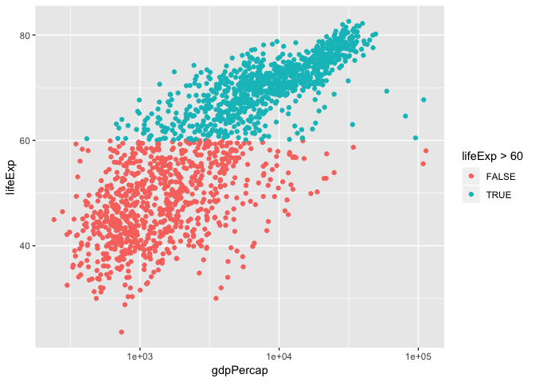
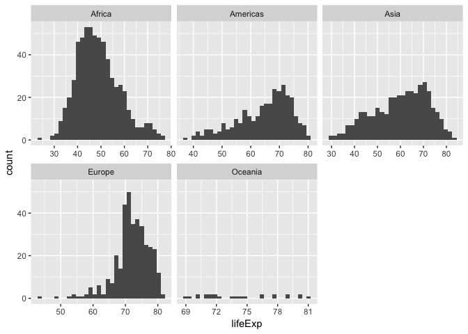
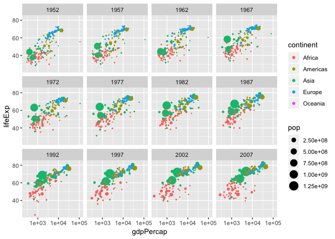
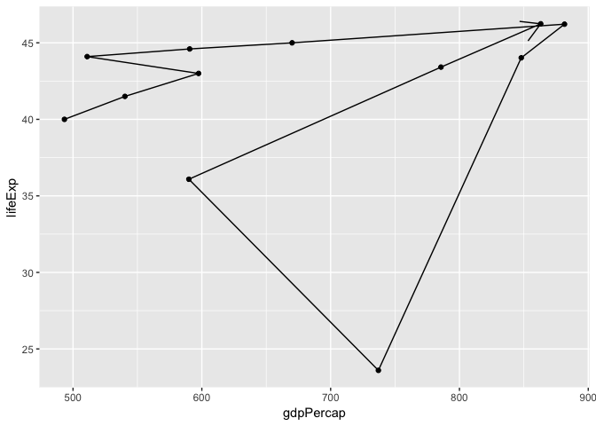
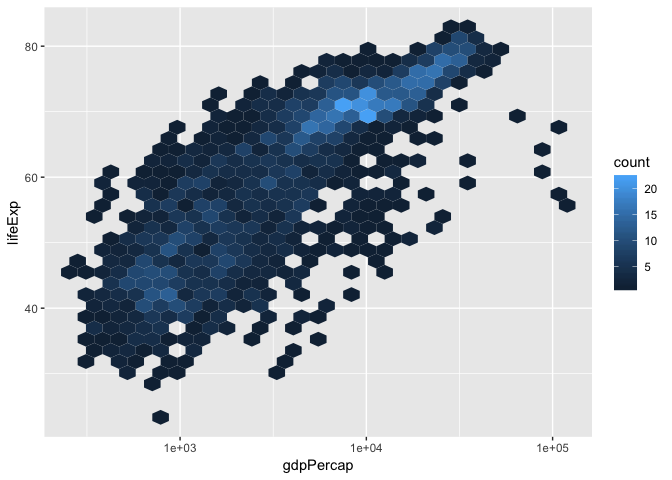

cm007 Exercises: Exploring Aesthetic Mappings
================

``` r
library(tidyverse)
```

    ## ── Attaching packages ───────── tidyverse 1.2.1 ──

    ## ✔ ggplot2 3.0.0     ✔ purrr   0.2.5
    ## ✔ tibble  1.4.2     ✔ dplyr   0.7.6
    ## ✔ tidyr   0.8.1     ✔ stringr 1.3.1
    ## ✔ readr   1.1.1     ✔ forcats 0.3.0

    ## ── Conflicts ──────────── tidyverse_conflicts() ──
    ## ✖ dplyr::filter() masks stats::filter()
    ## ✖ dplyr::lag()    masks stats::lag()

``` r
library(gapminder)
```

Beyond the x and y aesthetics
=============================

Switch focus to exploring aesthetic mappings, instead of geoms.

Shapes
------

-   Try a scatterplot of `gdpPercap` vs `pop` with a categorical variable (continent) as `shape`.

``` r
gvsl <- ggplot(gapminder, aes(gdpPercap, lifeExp)) +
    scale_x_log10() 
gvsl + geom_point(aes(shape=continent), alpha=0.2)
```


-   As with all (?) aesthetics, we can also have them *not* as aesthetics!
    -   Try some shapes: first as integer from 0-24, then as keyboard characters.
    -   What's up with `pch`?

``` r
gvsl + geom_point(shape = 7)
```


``` r
gvsl + geom_point(pch = 7)
```


``` r
gvsl + geom_point(pch = "$")
```


List of shapes can be found [at the bottom of the `scale_shape` documentation](https://ggplot2.tidyverse.org/reference/scale_shape.html).

Colour
------

Make a scatterplot. Then:

-   Try colour as categorical variable.

``` r
gvsl + geom_point(aes(colour = continent))
```


-   Try `colour` and `color`.
-   Try colour as numeric variable.
    -   Try `trans="log10"` for log scale.

``` r
gvsl + geom_point(aes(colour = pop)) + scale_colour_continuous(trans="log10")
```


``` r
gvsl + geom_point(aes(colour = lifeExp > 60))
```



Make a line plot of `gdpPercap` over time for all countries. Colour by `lifeExp > 60` (remember that `lifeExp` looks bimodal?)

Try adding colour to a histogram. How is this different?

``` r
ggplot(gapminder, aes(lifeExp)) +
  geom_histogram(aes(fill = continent))
```

    ## `stat_bin()` using `bins = 30`. Pick better value with `binwidth`.


Facetting
---------

Make histograms of `gdpPercap` for each continent. Try the `scales` and `ncol` arguments.

``` r
ggplot(gapminder, aes(lifeExp)) +
  facet_wrap(~ continent) +
  geom_histogram()
```

    ## `stat_bin()` using `bins = 30`. Pick better value with `binwidth`.


``` r
ggplot(gapminder, aes(lifeExp)) +
  facet_wrap(~ continent, scales = "free_x") +
  geom_histogram()
```

    ## `stat_bin()` using `bins = 30`. Pick better value with `binwidth`.



Remove Oceania. Add another variable: `lifeExp > 60`.

``` r
ggplot(gapminder, aes(gdpPercap)) +
  facet_grid(continent ~ lifeExp > 60) +
  geom_histogram()
```

    ## `stat_bin()` using `bins = 30`. Pick better value with `binwidth`.


Bubble Plots
------------

``` r
gvsl + geom_point(aes(size = pop), alpha=0.2) + 
  scale_size_area() #cahnges size to rep. magnitude of numeric variable
```


-   Add a `size` aesthetic to a scatterplot. What about `cex`?
-   Try adding `scale_radius()` and `scale_size_area()`. What's better?
-   Use `shape=21` to distinguish between `fill` (interior) and `colour` (exterior).

``` r
gvsl + geom_point(aes(size = pop, fill = continent), 
                  shape=21, colour ="black", alpha=0.2)
```


"Complete" plot
---------------

Let's try plotting much of the data.

-   gdpPercap vs lifeExp with pop bubbles
-   facet by year
-   colour by continent

``` r
gvsl + geom_point(aes(size=pop, colour = continent)) +
  scale_size_area() +
  facet_wrap(~ year)
```



Continue from last time (geom exploration with `x` and `y` aesthetics)
======================================================================

Path plots
----------

Let's see how Rwanda's life expectancy and GDP per capita have evolved over time, using a path plot.

-   Try `geom_line()`. Try `geom_point()`.
-   Add `arrow=arrow()` option.
-   Add `geom_text`, with year label.

``` r
gapminder %>% 
  filter(country == "Rwanda") %>% 
  ggplot(aes(gdpPercap, lifeExp)) +
  #scale_x_log10() +
  geom_point() +
  geom_path(arrow = arrow()) #connects the dots
```



Two categorical variables
-------------------------

Try `cyl` (number of cylinders) ~ `am` (transmission) in the `mtcars` data frame.

-   Scatterplot? Jitterplot? No.
-   `geom_count()`.
-   `geom_bin2d()`. Compare with `geom_tile()` with `fill` aes.

``` r
mtcars
```

    ##                      mpg cyl  disp  hp drat    wt  qsec vs am gear carb
    ## Mazda RX4           21.0   6 160.0 110 3.90 2.620 16.46  0  1    4    4
    ## Mazda RX4 Wag       21.0   6 160.0 110 3.90 2.875 17.02  0  1    4    4
    ## Datsun 710          22.8   4 108.0  93 3.85 2.320 18.61  1  1    4    1
    ## Hornet 4 Drive      21.4   6 258.0 110 3.08 3.215 19.44  1  0    3    1
    ## Hornet Sportabout   18.7   8 360.0 175 3.15 3.440 17.02  0  0    3    2
    ## Valiant             18.1   6 225.0 105 2.76 3.460 20.22  1  0    3    1
    ## Duster 360          14.3   8 360.0 245 3.21 3.570 15.84  0  0    3    4
    ## Merc 240D           24.4   4 146.7  62 3.69 3.190 20.00  1  0    4    2
    ## Merc 230            22.8   4 140.8  95 3.92 3.150 22.90  1  0    4    2
    ## Merc 280            19.2   6 167.6 123 3.92 3.440 18.30  1  0    4    4
    ## Merc 280C           17.8   6 167.6 123 3.92 3.440 18.90  1  0    4    4
    ## Merc 450SE          16.4   8 275.8 180 3.07 4.070 17.40  0  0    3    3
    ## Merc 450SL          17.3   8 275.8 180 3.07 3.730 17.60  0  0    3    3
    ## Merc 450SLC         15.2   8 275.8 180 3.07 3.780 18.00  0  0    3    3
    ## Cadillac Fleetwood  10.4   8 472.0 205 2.93 5.250 17.98  0  0    3    4
    ## Lincoln Continental 10.4   8 460.0 215 3.00 5.424 17.82  0  0    3    4
    ## Chrysler Imperial   14.7   8 440.0 230 3.23 5.345 17.42  0  0    3    4
    ## Fiat 128            32.4   4  78.7  66 4.08 2.200 19.47  1  1    4    1
    ## Honda Civic         30.4   4  75.7  52 4.93 1.615 18.52  1  1    4    2
    ## Toyota Corolla      33.9   4  71.1  65 4.22 1.835 19.90  1  1    4    1
    ## Toyota Corona       21.5   4 120.1  97 3.70 2.465 20.01  1  0    3    1
    ## Dodge Challenger    15.5   8 318.0 150 2.76 3.520 16.87  0  0    3    2
    ## AMC Javelin         15.2   8 304.0 150 3.15 3.435 17.30  0  0    3    2
    ## Camaro Z28          13.3   8 350.0 245 3.73 3.840 15.41  0  0    3    4
    ## Pontiac Firebird    19.2   8 400.0 175 3.08 3.845 17.05  0  0    3    2
    ## Fiat X1-9           27.3   4  79.0  66 4.08 1.935 18.90  1  1    4    1
    ## Porsche 914-2       26.0   4 120.3  91 4.43 2.140 16.70  0  1    5    2
    ## Lotus Europa        30.4   4  95.1 113 3.77 1.513 16.90  1  1    5    2
    ## Ford Pantera L      15.8   8 351.0 264 4.22 3.170 14.50  0  1    5    4
    ## Ferrari Dino        19.7   6 145.0 175 3.62 2.770 15.50  0  1    5    6
    ## Maserati Bora       15.0   8 301.0 335 3.54 3.570 14.60  0  1    5    8
    ## Volvo 142E          21.4   4 121.0 109 4.11 2.780 18.60  1  1    4    2

``` r
ggplot(mtcars, aes(factor(cyl), factor(am))) +
#  geom_count()
# or geom_jitter tho besty is!
  geom_bin2d()
```


Overplotting
------------

Try a scatterplot with:

-   Alpha transparency.
-   `geom_hex()`
-   `geom_density2d()`
-   `geom_smooth()`

``` r
gvsl + geom_hex()
```



``` r
gvsl + geom_density2d()
```


``` r
##heatmap = change scale ??
```

``` r
gvsl + geom_smooth() +
  geom_point(alpha = 0.2) + geom_smooth(method = "outline")
```

    ## `geom_smooth()` using method = 'gam' and formula 'y ~ s(x, bs = "cs")'

    ## Warning: Computation failed in `stat_smooth()`:
    ## object 'outline' of mode 'function' was not found


Bar plots
---------

How many countries are in each continent? Use the year 2007.

1.  After filtering the gapminder data to 2007, make a bar chart of the number of countries in each continent. Store everything except the geom in the variable `d`.

``` r
gapminder %>% 
  filter(year == 2007) %>% 
  ggplot(aes(x=continent)) +
  geom_bar()
```


1.  Notice the y-axis. Oddly, `ggplot2` doesn't make it obvious how to change to proportion. Try adding a `y` aesthetic: `y=..count../sum(..count..)`.

**Uses of bar plots**: Get a sense of relative quantities of categories, or see the probability mass function of a categorical random variable.

Polar coordinates
-----------------

-   Add `coord_polar()` to a scatterplot.

``` r
gvsl + geom_point() + coord_polar()
```


``` r
#maybe use this for your smolt data
```

Want more practice?
===================

If you'd like some practice, give these exercises a try

**Exercise 1**: Make a plot of `year` (x) vs `lifeExp` (y), with points coloured by continent. Then, to that same plot, fit a straight regression line to each continent, without the error bars. If you can, try piping the data frame into the `ggplot` function.

UGLY GRAPH:

``` r
yvsl <- ggplot(gapminder, aes(year, lifeExp)) 
yvsl + geom_point(aes(colour = continent)) +
  geom_smooth(aes(colour = continent))
```

    ## `geom_smooth()` using method = 'loess' and formula 'y ~ x'


``` r
yvsl <- ggplot(gapminder, aes(year, lifeExp)) 
yvsl + geom_point(aes(colour = continent)) +
  geom_smooth(method = "lm", se = FALSE, aes(colour = continent))
```


**Exercise 2**: Repeat Exercise 1, but switch the *regression line* and *geom\_point* layers. How is this plot different from that of Exercise 1?

``` r
yvsl <- ggplot(gapminder, aes(year, lifeExp)) 
yvsl + geom_point(aes(colour = continent)) +
  geom_smooth(method = "lm", se = FALSE, aes(colour = continent))
```


**Exercise 3**: Omit the `geom_point` layer from either of the above two plots (it doesn't matter which). Does the line still show up, even though the data aren't shown? Why or why not?

``` r
yvsl <- ggplot(gapminder, aes(year, lifeExp)) 
yvsl + geom_smooth(method = "lm", se = FALSE, aes(colour = continent))
```


**Exercise 4**: Make a plot of `year` (x) vs `lifeExp` (y), facetted by continent. Then, fit a smoother through the data for each continent, without the error bars. Choose a span that you feel is appropriate.

``` r
yvsl + geom_point() +
  facet_wrap(~ continent) +
  geom_smooth(se = FALSE)
```

    ## `geom_smooth()` using method = 'loess' and formula 'y ~ x'


**Exercise 5**: Plot the population over time (year) using lines, so that each country has its own line. Colour by `gdpPercap`. Add alpha transparency to your liking.

``` r
pvsy <- ggplot(gapminder, aes(year, pop))
pvsy + geom_smooth()
```

    ## `geom_smooth()` using method = 'gam' and formula 'y ~ s(x, bs = "cs")'


**Exercise 6**: Add points to the plot in Exercise 5.
